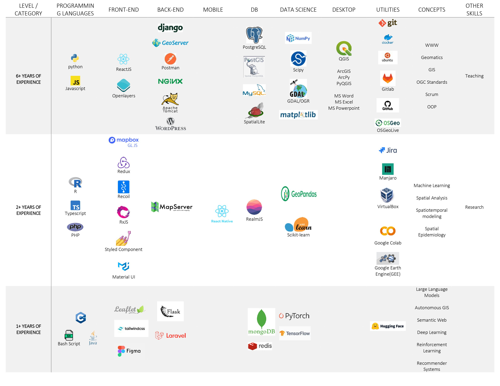

# 💫 About Me:

🔭 **Current Focus:** I'm actively working on ML-enabled Web and Mobile GIS applications, with over 8 years of experience in Web GIS application development (since the age of 19).   
👯 **Collaborations:** I’m open to collaborating on geospatial research projects and applications.   
🌱 **Learning Journey:** Currently, I'm diving deeper into LLMs (Large Language Models) and GIS Agents.   
💬 **Expertise:** Feel free to reach out to me regarding GIS, Web Development, and Machine Learning.   
📚 **Research Background:** My research includes the spatiotemporal prediction of diseases and identifying climate-related factors influencing their geographic spread. My work has been published in [Scientific Reports (Nature)](https://www.nature.com/articles/s41598-023-40865-4) and [Spatial Information Research (Springer)](https://link.springer.com/article/10.1007/s41324-024-00595-9). Both geostatistical and machine learning models were applied in these studies.

## 🌐 Socials:
     

# 💻 Tech Stack:
**The technologies I have worked with can be seen in the following picture.**   

## 🏆 GitHub Trophies

<!-- 
# 📊 GitHub Stats:

 
 

 

-->

<!-- Proudly created with GPRM ( https://gprm.itsvg.in ) -->
